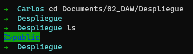
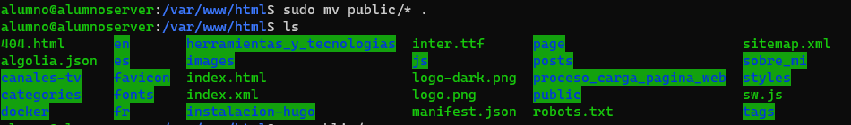

# Tarea Despliegue 02_Respaldando_La_Web

## 01. Accedo a mi carpeta en donde tengo los archivos estáticos de la web

## 02. Para simplificar el acceso, creo una configuración en el archivo config de ssh

## 03. Me conecto al servidor por sftp y como tengo para identificación configurada mi clave SSH me pide mi contraseña del archivo de identificación

## 4. Usando mput, del protocolo ftp, subo la carpeta a mi carpeta personal del servidor

## 5. Ahora me conecto por SSH para instalar apache y poner la carpeta en su lugar indicado para que apache pueda cargarla (me conecto usando el alias de mi archivo config)

## 6. Instalo el paquete apache2

## 7. Muevo mi archivo a la ruta de los archivos de apache2

## 8. Ahora defino los permisos de forma que el propietario quede www-data para evitar problemas de permisos

## Con esto ya si entro en el navegador a la URL de la pagina ya carga desde el servidor apache

