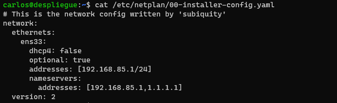
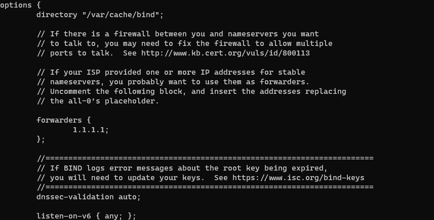
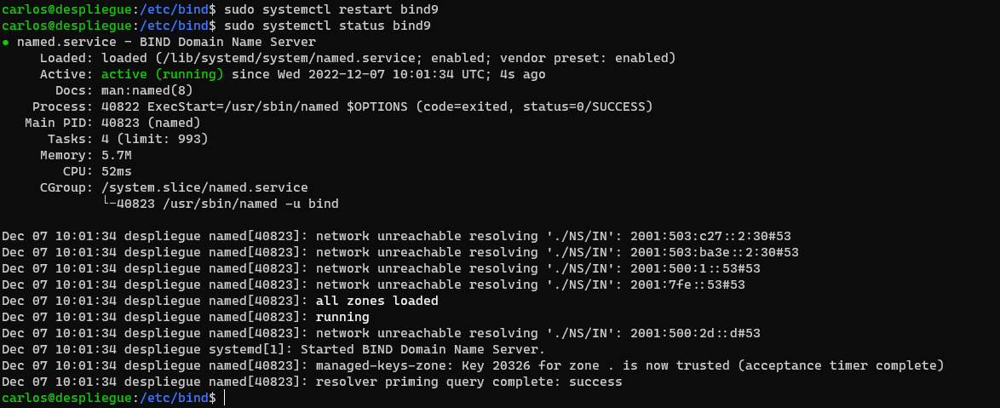
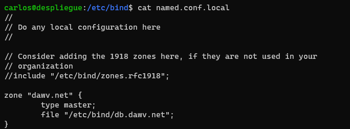
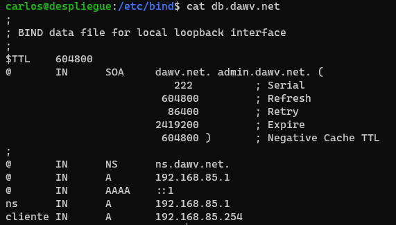
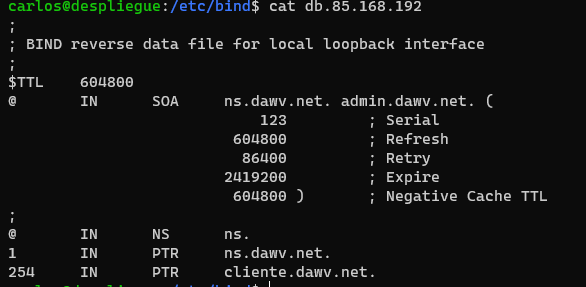
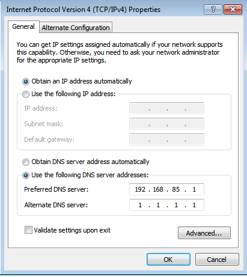
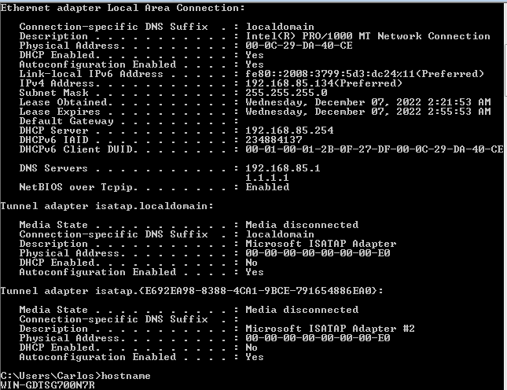
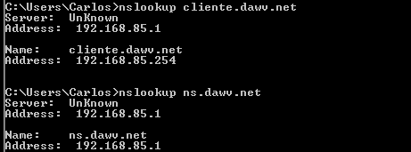
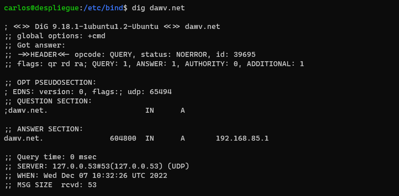

# Proyecto DNS

**Autor**: Carlos Sesma

**Fecha**: 2022-12-07

---

<div class="toc">

- [Proyecto DNS](#proyecto-dns)
  - [Introducción](#introducción)
  - [Objetivos](#objetivos)
  - [Procedimiento](#procedimiento)
    - [Actualización del sistema](#actualización-del-sistema)
    - [Configuración de la red](#configuración-de-la-red)
    - [Instalación y configuración del servidor DNS](#instalación-y-configuración-del-servidor-dns)
    - [Configuración  del forwarder](#configuración--del-forwarder)
    - [Prueba de resolución externa](#prueba-de-resolución-externa)
    - [Creación de la zona directa](#creación-de-la-zona-directa)
    - [Creación de la zona inversa](#creación-de-la-zona-inversa)
    - [Reiniciar el servicio de DNS](#reiniciar-el-servicio-de-dns)
    - [Prueba de resolución interna](#prueba-de-resolución-interna)
    - [Prueba de resolución desde cliente](#prueba-de-resolución-desde-cliente)

</div>

---

## Introducción

El DNS es un servicio encargado de traducir nombres de dominio en direcciones IP y viceversa. Es un servicio muy importante en la red, ya que permite que los usuarios puedan acceder a los recursos de la red de forma más sencilla evitando tener que memorizar las direcciones IP de los recursos.

En este proyecto vamos a realizar la configuración de un servidor DNS en un servidor Ubuntu Server 20.04. Para ello vamos a utilizar el servicio de DNS BIND9.

___

## Objetivos

- Instalar y configurar un servidor DNS en Ubuntu Server 20.04.
- Configurar el servidor DNS para que resuelva los nombres de dominio de nuestra red.
- Configurar el servidor DNS para que resuelva los nombres de dominio de Internet mediante un servidor DNS externo.

<div style="page-break-after: always"></div>

## Procedimiento

### Actualización del sistema

Antes de comenzar con la instalación, vamos a actualizar el sistema para asegurarnos de que tenemos la última versión de los paquetes.

```bash
sudo apt update
sudo apt upgrade
```

### Configuración de la red

Vamos a configurar la red de nuestro servidor Ubuntu Server 20.04 para que tenga una dirección IP estática.

```bash
sudo nano /etc/netplan/00-installer-config.yaml
```

```yaml
network:
  ethernets:
    ens33:
      dhcp4: false
      optional: true
      addresses: [192.168.85.1/24]
```



<div style="page-break-after: always"></div>

### Instalación y configuración del servidor DNS

Vamos a instalar el servicio de DNS *BIND9*  y el conjunto de herramientas *DNSUTILS* en nuestro servidor Ubuntu Server 20.04.

```bash
sudo apt install bind9 dnsutils
```


### Configuración  del forwarder

Vamos a configurar el servidor DNS para que resuelva los nombres de dominio de Internet mediante un servidor DNS externo.

```bash
sudo vim /etc/bind/named.conf.options
```

```conf
options {
    directory "/var/cache/bind";

    forwarders {
        1.1.1.1;
    }
    dnssec-validation auto;
    listen-on-v6 { any; };
};
```



Una vez configurado el forwarder, vamos a reiniciar el servicio de DNS.

Podemos mirar el estado del servicio para comprobar que se ha iniciado correctamente y que no hay ningún error.

```bash
sudo systemctl restart bind9
sudo systemctl status bind9
```



<div style="page-break-after: always"></div>

### Prueba de resolución externa

Vamos a comprobar que el servidor DNS resuelve correctamente los nombres de dominio de Internet.

```bash
nslookup blog.usarr.tech
```

Cuando ejecutemos el comando anterior, nos debería aparecer la siguiente salida:

Output:

```bash
Server:         127.0.0.53
Address:        127.0.0.53#53

Non-authoritative answer:
blog.usarr.tech       canonical name = cname.vercel-dns.com.
Name:   cname.vercel-dns.com
Address:    76.76.21.241
Name:   cname.vercel-dns.com
Address: 76.76.21.9
```


<div style="page-break-after: always"></div>

### Creación de la zona directa

Vamos a crear la zona directa para la red dawv.net.

```bash
sudo vim /etc/bind/named.conf.local
 ```

 ```conf
zone "dawv.net" {
    type master;
    file "/etc/bind/db.dawv.net";
};
```



Vamos a crear el fichero de la zona directa. Para ello copiamos el fichero de ejemplo que nos proporciona el servicio de DNS BIND9.

```bash
sudo cp /etc/bind/db.local /etc/bind/db.dawv.net
```

<div style="page-break-after: always"></div>

Despues de copiarlo, vamos a modificar el fichero para que contenga la información de nuestra zona directa remplazando los datos de ejemplo por nuestros datos.

```bash
sudo vim /etc/bind/db.dawv.net
```

```conf
$TTL    604800
@       IN      SOA     dawv.net. admin.dawv.net. (
                           222          ; Serial
                         604800         ; Refresh
                          86400         ; Retry
                        2419200         ; Expire
                         604800 )       ; Negative Cache TTL
;
@       IN      NS      ns.dawv.net.
@       IN      A       192.168.85.1
@       IN      AAAA    ::1
ns      IN      A       192.168.85.1
cliente IN      A       192.168.85.254
```



### Creación de la zona inversa

Para esto vamos a repetir los pasos que hemos realizado para la zona directa, pero en este caso vamos a clonear el fichero de ejemplo de la zona inversa.

```bash
sudo cp /etc/bind/db.127 /etc/bind/db.85.168.192
```

Despues de copiarlo, vamos a modificar el fichero para que contenga la información de nuestra zona inversa remplazando los datos de ejemplo por nuestros datos.

```bash
sudo vim /etc/bind/db.85.168.192
```

```conf
$TTL    604800
@       IN      SOA     ns.dawv.net. admin.dawv.net. (
                            123         ; Serial
                         604800         ; Refresh
                          86400         ; Retry
                        2419200         ; Expire
                         604800 )       ; Negative Cache TTL
;
@       IN      NS      ns.
1       IN      PTR     ns.dawv.net.
254     IN      PTR     cliente.dawv.net.
```



### Reiniciar el servicio de DNS

Reinciaremos el servicio de DNS para que se apliquen los cambios. Luego comprobaremos que el servicio se ha iniciado correctamente y que no hay ningún error.

```bash
sudo systemctl restart bind9
sudo systemctl status bind9
```

<div style="page-break-after: always"></div>

### Prueba de resolución interna

Una vez reiniciado ya nos deberia de funcionar la resolución interna.

```bash
nslookup ns.dawv.net
```

Output:

```bash
Server:         127.0.0.53
Address:        127.0.0.53#53

Non-authoritative answer:
Name:   ns.dawv.net
Address: 192.168.85.1
```


<div style="page-break-after: always"></div>

### Prueba de resolución desde cliente

Vamos a comprobar que el servicio funciona correctamente desde el cliente.

Para ello configuramos en el panel de control de Windows la dirección IP del servidor DNS.

Para ello vamos a abrir el panel de control y vamos a entrar en la opción de centro de redes y recursos compartidos. Una vez dentro vamos a seleccionar la opción de adaptador de red.
En la ventana que se nos abre, vamos a seleccionar la opción de Internet Protocol Version 4 (TCP/IPv4) y vamos a pulsar en propiedades.



Para confirmar que se ha cambiado podemos comprobarlo desde la consola de Windows.

```powershell
ipconfig /all
```

Y nos mostrará la información de la tarjeta de red.


<div style="page-break-after: always"></div>

Comprobamos que el servicio resuelve correctamente desde el cliente.

```powershell
nslookup cliente.dawv.net
nslookup ns.dawv.net
```




<style>
body{
    font-size: 1.2em;
    font-family: system-ui;

}
.toc ul{
    list-style: none;
}

/*
a{
    color: #2b77ef;
    text-decoration: none;
}
p{
    text-align: justify;
}
h1, h2, h3, h4, h5, h6{
    font-weight: 600;
}

*/
</style>  
